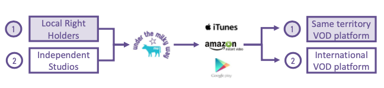
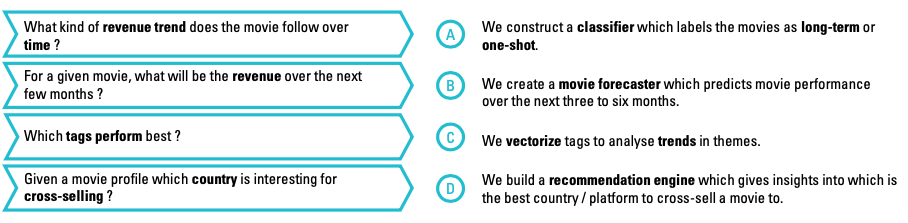
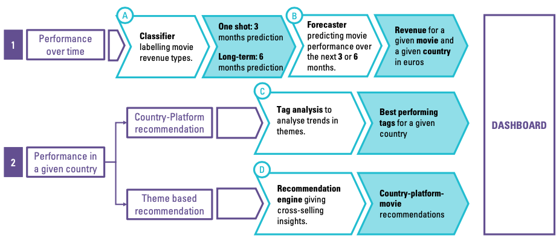
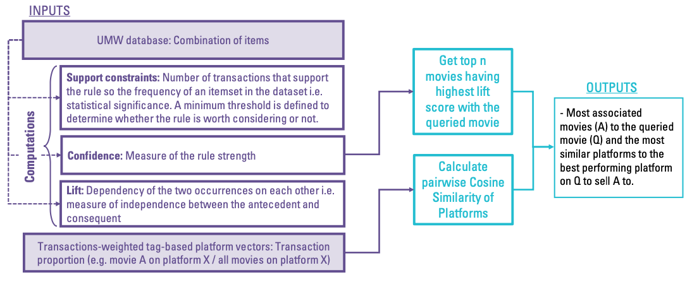
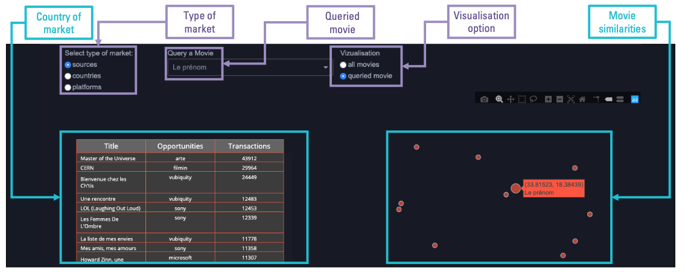
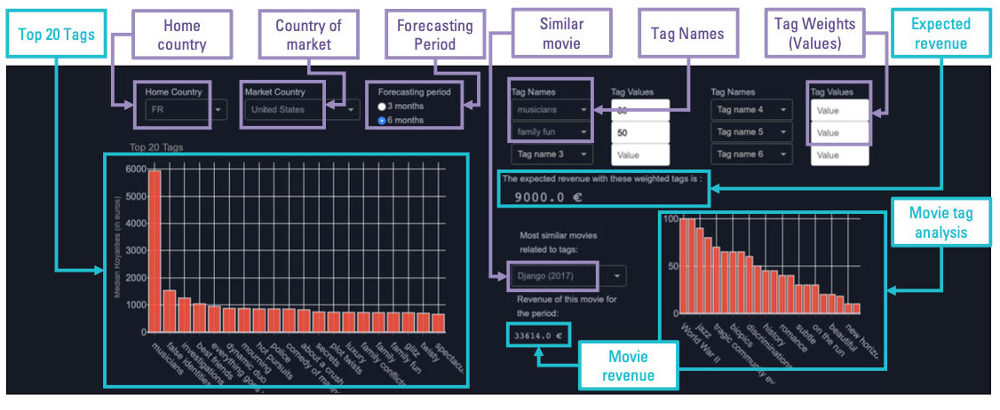
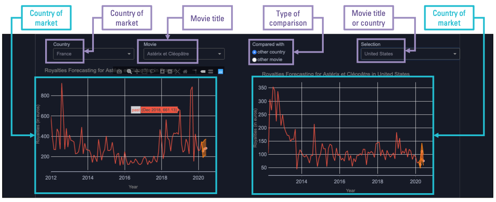

# 🎥 Under The Mily Way Dashboard
_The tools developed and incorporated to a dashboard allow the company Under The Milky Way (UMW) to explore cross-selling opportunities and to estimate the potential revenue of a movie from its main themes_

_This work is related to a __corportate research project with the company Under The Milky Way__ and was done by C. Morand-Dval, R. Chen, I. Zizi and A. Ohleyer._

__Due to confidential data, the dashboard cannot be replicated from the code__

## BUSINESS INSIGHTS
  This project was summoned by __Under The Milky Way__, a company specialised in aggregating international film rights and distributing them on global VOD platforms. The digital shift has caused major changes in the film distribution market, resulting in a linear growth of the VOD market since 2012. To stay competitive, UMW has for ambition to use its current catalogue and its history of transactions to predict the performance of movies and identify potential opportunities.

#### New players
  The digital shift has contributed to the __transformation__ of the film distribution market. It has led to the development of new business models and therefore, new players such as __Apple__ (iTunes), __Google__, __Amazon__ and __Netflix__ have become competitive. The time where audience used to rush to theatres to view a movie is long gone and all media displays tend to converge to digital platforms.

#### Global Market
  
  The market is no longer local. Movies are sold in __packages of metadata__. The physical and financial barriers to international distribution are low. The __change in scale__ has created new difficulties for local platforms. Even though they are closer to the audience, they must now deal with the __threats__ of the __GAFAN__. This phenomenon is the result of the delinearization of the value chain – there are multiple ways to distribute a film nowadays. Amazon (Amazon Video) or Apple (iTunes) obtains their revenues from various activities – VOD is not their main source of revenue; they are therefore less vulnerable if a movie fails.

#### VOD revenues
  There are multiple models for VOD to collect revenues. Transactional VOD includes renting (the customer has the right to view the movie for a limited amount of time), or Electronic Sell Through. For these models, the right holder obtains a share of the sales revenues. Subscription VOD are VOD for which consumers pay a monthly fee. Right holders can earn their revenues from license fees (fixed payment for an amount of time), streaming (fee for the streaming time or Amazon Channels

#### Under the Milky Way is a VOD aggregator
UMW provides a comprehensive and experienced __middleman__ between __right-holders__ and __VOD platforms__. It is responsible for various aspects of the distribution chain, __legal, financial, technical, marketing and editorial__.

## UMW models to compete on the VOD market
UMW is part of two models, domestic right aggregation and international right aggregation. Locally the services are for a single country while
internationally, UMW distributes programs on VOD through Direct-to-Digital releases.
1.  __Domestic Rights Aggregation__: Local VOD distribution on behalf of right holders that do not work directly with the VOD operators in their territory.
2. __International Rights Aggregation__:
Direct-To-Digital distribution on VOD platforms internationally (distribution opportunities to large independent studios).

## Challenge

Our goal is to characterise the __performance__ of a movie, identifying the __features__ relevant to its success and its potential to be __cross-sold__ to new countries across various __platforms__. Under the Milky Way is a movie aggregator with offices in France and the US. It has gathered more than 5,000 films distributed in 15 platforms. It markets its movies in over 100 countries.

#### Our challenge
Using the UMW database, we developed four algorithms to characterise and forecast movie performance as well as to recommend potential cross-
selling opportunities:

#### Approach
We developed __tools__ to answer each section of the problem.The performance of each movie can be evaluated over time. The movies are __labelled__ first so their __forecasted performance__ is more accurate. __Cross-selling opportunities__ are computed using a __recommendation engine__ and for each country we analyse tags to output the movie themes responsible for the __highest revenues__.

## Dashboard

#### Recommender Engine
We designed a more complex __recommendation engine__ based on the __Agrawal algorithm__. This method revolves around finding __association rules__ in a large dataset of transactions with some minimum amount of __confidence__. A typical example would be if movie A and movie B have a high success in France, there is a 90% chance movie 3 will also be successful in France. Movie A and B are the __antecedent__, movie C the __consequent__ of the rule and 90% the __confidence factor__.

This tab of the __dashboard__ displays the output of the __recommendation engine__. The user can input the __type of market__ they are trying to analyse, a __queried movie__ and the __type of visualisation__ they are interested in. There are two outputs to this query, a __table__ containing the __most associated movies__ and __country / platform__ opportunities as well as their respective __transaction__ amount, and the __movie similarity 2D representation__.

#### Forecaster
This tab of the __dashboard__ we built displays performance of movies __over time__. The user inputs the country where the film is marketed and the __title__ of the movie. This tabisdesignedforcomparisontherefore,theusercanlookat the performance of the same movie in two countries or the movie performances of two movies in different countries.

#### Tag Analysis
This tab of the __dashboard__ illustrates on one side the __most performing tags__ based on the median revenue of the movie in that category. The user inputs the __home country__ and __country of market__ and __forecasting period__. On the other side, the user enters __tags__ and their __weight__ in addition to the other inputs to obtain a __prediction__ of the revenue for that period as well as the movies __containing__ those tags and their __revenues__.

## Conclusion
#### Challenge
The __performance__ of a movie is characterized by the __royalties__ obtained __over time__ across all __platforms__ and all __countries__. We identified the most relevant feature as the __origin of the movie__ and __its themes__. All other criteria have been analysed but does influence the results of predictions as much as those mentioned.

#### Tools
We have built __four__ different tools to evaluate the performance of a movie and its potential to be cross-sold to another country, platform or both combined. Our __classifier__ labels whether the movies are long-term or one-shot. The __forecaster__ predicts the potential revenue earned for the next __3 months__ for a __specific movie__, __country origin__ and __country of market__. The __recommendation engine__ is designed to __predict__ the best __movie__ to __cross-sell__ to which country-platform pair i.e. it outputs a list of movies to be marketed on different platforms and countries based on a __movie queried__. Finally,the tag analysis allows UMW to evaluate which tags perform better in which country of market. All the __tools__ are easily accessible via the __dashboard__. It has been built with a __long-term__ use perspective in mind.

#### Business Impact
Through out our __analyses__ and the use of the __tools__ created, we have used the __sales data__ to __predict the potential performance__ of films using various __criteria__. We focused on cross-selling movies already in __UMW portfolio__ to new countries and platforms. The company can better __evaluate__ film performances and look for the __most performing__ films to grow its revenues.
